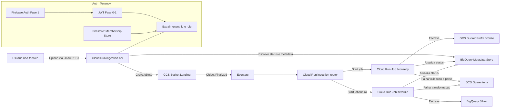

# Status do Projeto (Dativerso) — 2026-05-27

Este documento consolida o estado do projeto **até o momento** e registra um fluxo end-to-end em Mermaid.

## Resumo (MVP: Datalake)
- Público: usuário **não-técnico**.
- Objetivo: “subir um arquivo e obter uma versão **pronta para uso** (consulta/dashboards), com rastreabilidade e erro explicável”.
- Princípios: **baixo custo** (serverless/sob demanda), multitenancy, operação simples.

## Componentes no repositório

### Serviços (Cloud Run)
- `services/ingestion_api`: API REST para upload de arquivos (CSV/JSON/Parquet) com multitenancy por `tenant_id` derivado do token.
- `services/ingestion_router`: recebe eventos do Eventarc (GCS object finalized em landing) e dispara Cloud Run Jobs (`bronzeify` e futuro `silverize`).
- `services/identity_api`: serviço de identidade (base para flows de auth/tenancy).

### Infra (Terraform)
- `infra/terraform`: provisionamento GCP (buckets, Cloud Run, Eventarc, BigQuery metadata store, Artifact Registry, etc.).
- `infra/terraform/terraform.tfvars`: configurações por ambiente (project/region/locations/auth mode/imagens e invokers).

### Documentação existente
O diretório `docs/` já possui referências e decisões de arquitetura (auth, API Gateway, medallion, custos e runbooks).

## Tenancy e Auth (MVP)
- Tenancy: tudo pertence a um `tenant_id` (empresa/organização).
- Papéis: `admin` e `viewer` (mínimo).
- Estratégia por fases:
  - **Fase 0 (dev/demos)**: token colado; backend extrai `tenant_id`/`role` do JWT (ou modo “unverified” apenas em dev).
  - **Fase 1 (MVP comercial)**: **Firebase Auth (magic link)** + Membership store no **Firestore**.
    - Autenticação via JWT (JWKS) e autorização via membership (resolve `tenant_id` e `role`).

## Data Lake (Medallion)
Arquitetura de camadas (recorte MVP):
- **Landing (GCS)** → **Bronze (GCS)** → **Silver (BigQuery)**.
- **Quarentena (GCS)** quando falhar validação/parse, com mensagem acionável.
- Execução orientada a eventos e com idempotência/retry (Eventarc/Cloud Run).

## Fluxo end-to-end (Mermaid)

## Observabilidade (mínimo recomendado)
- Logs estruturados (com `ingestion_id` e `tenant_id`) em todos serviços/jobs.
- Métricas: taxa de sucesso por etapa (landing/bronze/silver), tempo total por ingestão, retries.
- Alertas: aumento de falhas (parse/validação), latência acima do esperado, backlog de eventos/jobs.

## Convenções operacionais (até aqui)
- `ingestion_id`: “protocolo” copiável para suporte e rastreabilidade.
- `tenant_id`: base do isolamento (paths em GCS, datasets em BigQuery e filtros no metadata store).

## Próximos passos naturais (P1/P2)
- Encadeamento controlado: silver apenas após bronze ok.
- UI/endpoint de timeline por `ingestion_id` com linguagem não-técnica + “detalhes técnicos”.
- Regras guiadas para padronização em Silver (tipos, datas, nomes de colunas, etc.).
- Permissões por coleção/dataset (beyond “read-all do tenant”).
